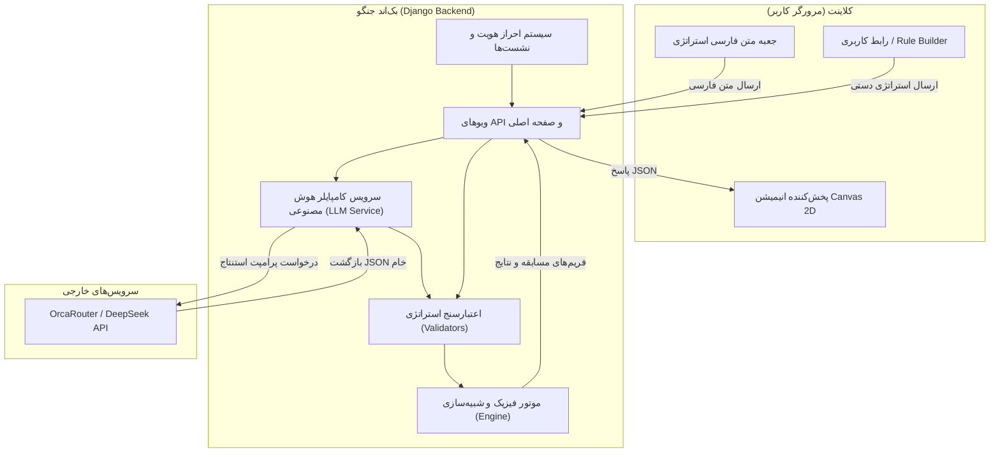
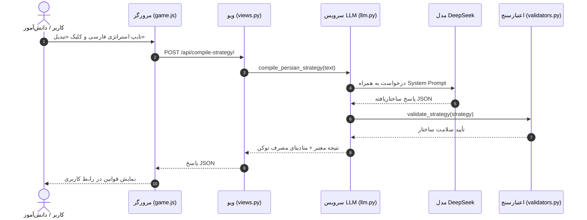
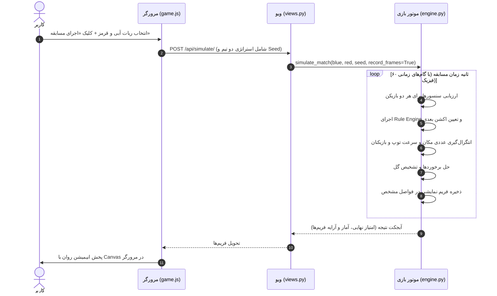

# معماری سیستم و چرخه حیات (Architecture & Lifecycle)

این سند معماری فنی، نحوه تعامل اجزا و جریان داده‌ها را در پروژه **AI Football Arena** شرح می‌دهد.

---

## ۱. نمای کلی معماری

پروژه به صورت **Server-Authoritative (سرور-محور)** طراحی شده است:

### اصول کلیدی معماری:
1. **سرور همه‌چیز را تعیین می‌کند:** تمام محاسبات برداری، برخوردها، منطق استراتژی و امتیازدهی روی سرور پایتون محاسبه می‌شود. جاوااسکریپت در مرورگر صرفاً فریم‌های دریافت شده را روی عنصر `<canvas>` رندر می‌کند.
2. **غیرقابل دستکاری در سمت کلاینت:** دستکاری در کدهای مرورگر یا ارسال مقادیر نادرست نمی‌تواند قوانین یا نتایج فیزیک بازی را تغییر دهد؛ زیرا تمام استراتژی‌ها ابتدا توسط [`validate_strategy`](../game/validators.py) ارزیابی قطعی می‌شوند.
3. **جداسازی کامل هوش مصنوعی از فیزیک بازی:** هوش مصنوعی (LLM) فقط هنگام ترجمه متن فارسی به ساختار قوانین اجرا می‌شود. در حین مسابقه هیچ درخواست شبکه‌ای یا مدل زبانی اجرا نمی‌شود و سرعت شبیه‌سازی فوق‌العاده بالاست (بیش از ۱۰۰ مسابقه در چند ثانیه).

---

## ۲. اجزای سیستم (Components)

| بخش | مسیر فایل | مسئولیت |
| :--- | :--- | :--- |
| **موتور بازی** | [`game/engine.py`](../game/engine.py) | شبیه‌سازی ریاضی ۲ بعدی، محاسبه سنسورها، برخوردها، حرکت بازیکنان و توپ، ضبط فریم‌ها |
| **تعاریف استراتژی** | [`game/strategy.py`](../game/strategy.py) | تعریف سنسورها، عملگرها، اکشن‌ها و استراتژی‌های پیش‌فرض مسابقه |
| **اعتبارسنجی** | [`game/validators.py`](../game/validators.py) | بررسی فرمت، سازگاری انواع داده و محدودیت‌های امنیتی Strategy JSON |
| **کامپایلر LLM** | [`game/services/llm.py`](../game/services/llm.py) | فراخوانی مدل زبانی از طریق OrcaRouter و تبدیل پاسخ به استراتژی استاندارد |
| **پرامپت سیستم** | [`game/prompts/strategy_compiler.py`](../game/prompts/strategy_compiler.py) | پرامپت اختصاصی تبدیل بدون تغییر در هوشمندی و با محافظت ضد تزریق پرامپت |
| **لایه وب و API** | [`game/views.py`](../game/views.py) | کنترل دسترسی با `@login_required` و مدیریت درخواست‌های HTTP |
| **رابط کاربری** | [`game/templates/`](../game/templates/) و [`game/static/`](../game/static/) | صفحات HTML5 راست‌چین، استایل‌های مدرن و کنترلر UI با جاوااسکریپت خالص |

---

## ۳. جریان داده‌ها (Data Flow)

### الف) جریان کامپایل استراتژی با هوش مصنوعی

---

### ب) جریان شبیه‌سازی مسابقه (Simulation Lifecycle)

---

## ۴. تکرارپذیری با Seed (Determinism)

یکی از قابلیت‌های کلیدی سیستم، **تکرارپذیری قطعی (Determinism)** است. هر مسابقه یک عدد `seed` می‌پذیرد:
- اگر دو استراتژی یکسان با یک `seed` مشخص اجرا شوند، نتیجه و تمام فریم‌های مسابقه بیت‌به‌بیت یکسان خواهند بود.
- در حالت `Batch Test`، مسابقات به صورت جفت‌های متقارن اجرا می‌شوند (در بازی‌های زوج، سمت زمین دو ربات عوض می‌شود) تا هیچ تیمی به دلیل سمت چپ یا راست بودن زمین برتری ناعادلانه نداشته باشد.

---

## ناوبری مستندات

- 🏠 **[بازگشت به صفحه اصلی مستندات (README.md)](../README.md)**
- ➡️ **گام بعدی: [موتور فیزیک و شبیه‌سازی بازی (game-engine.md)](./game-engine.md)**
- 📑 **سایر بخش‌ها:**
  - [سیستم استراتژی و قوانین (strategy-system.md)](./strategy-system.md)
  - [کامپایلر استراتژی با هوش مصنوعی (ai-compiler.md)](./ai-compiler.md)
  - [مرجع کامل APIها (api-reference.md)](./api-reference.md)
  - [احراز هویت و پنل مدیریت (auth-and-admin.md)](./auth-and-admin.md)
  - [نصب و استقرار (deployment-and-setup.md)](./deployment-and-setup.md)
