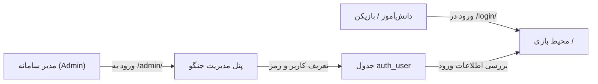

# احراز هویت و پنل مدیریت (Authentication & Admin)

این سند فرآیند ورود به سیستم، نحوه مدیریت کاربران و پیکربندی پنل مدیریت جنگو (Django Admin) را تشریح می‌کند.

---

## ۱. منطق احراز هویت (Authentication Model)

طبق نیازمندی‌های این پروژه کارگاهی/آموزشی:
1. **عدم وجود فرم ثبت‌نام عمومی (No Public Sign-up):** کاربران عادی امکان ثبت‌نام مستقیم از طریق صفحه عمومی وب را ندارند. این کار مانع از ساخت اکانت‌های اسپم و بی‌نام در کارگاه می‌شود.
2. **مدیریت متمرکز از پنل مدیریت (Admin-Driven Users):** حساب‌های کاربری فقط توسط مدیر سامانه (Superuser/Staff) از طریق پنل ادمین جنگو در `/admin/` ایجاد و مدیریت می‌شوند.
3. **حفاظت کامل از محیط بازی:** دسترسی به محیط بازی و تمام APIهای شبیه‌سازی مستلزم ورود موفق به حساب کاربری است.

---

## ۲. ایجاد کاربر مدیر کل (Superuser)

برای دسترسی اولیه به پنل مدیریت، یک حساب Superuser با اجرای دستور زیر در ترمینال یا محیط مجازی بسازید:

```bash
python manage.py createsuperuser
```

از شما مشخصات زیر خواسته می‌شود:
- **نام کاربری (Username):** به دلخواه (مثلاً `admin`)
- **ایمیل (Email address):** اختیاری (می‌توانید خالی بگذارید)
- **گذرواژه (Password):** حداقل ۸ کاراکتر

---

## ۳. ورود به پنل مدیریت و ایجاد کاربران

1. سرور جنگو را روشن کنید:
   ```bash
   python manage.py runserver
   ```
2. با مرورگر به آدرس زیر بروید:
   ```text
   http://127.0.0.1:8000/admin/
   ```
3. با نام کاربری و رمز مدیر کل وارد شوید.
4. در بخش **Authentication and Authorization** روی گزینه **Users** و سپس دکمه **Add user +** کلیک کنید.
5. نام کاربری و رمز عبور دانش‌آموز / بازیکن مورد نظر را وارد کرده و ذخیره نمایید.



---

## ۴. رابط کاربری ورود و خروج (Login & Logout UI)

### صفحه ورود ([`game/templates/game/login.html`](../game/templates/game/login.html))
- آدرس دسترسی مستقیم: `/login/`
- طراحی مدرن با تم تاریک منطبق بر ظاهر بازی
- پشتیبانی از زبان فارسی و راست‌چین (RTL)
- پشتیبانی هوشمند از پارامتر `next` (کاربر پس از ورود به همان صفحه‌ای که قبلاً قصد دسترسی به آن را داشته هدایت می‌شود)

### هدر کاربری ([`game/templates/game/index.html`](../game/templates/game/index.html))
در بالای صفحه اصلی بازی:
- نام کاربری فعال نمایش داده می‌شود: `👤 <username>`
- اگر کاربر دسترسی ادمین (`is_staff`) داشته باشد، دکمه میان‌بر `⚙️ پنل مدیریت` نمایش داده می‌شود.
- دکمه قرمز رنگ `خروج` فرم خروج استاندارد جنگو با توکن CSRF را ارسال کرده و کاربر را به صفحه لاگین بازمی‌گرداند.

---

## ۵. مدیریت استراتژی‌های کاربران در پنل ادمین (Strategy Management)

مدیران سامانه می‌توانند تمام استراتژی‌های ساخته‌شده توسط کاربران را در پنل ادمین ([`game/admin.py`](../game/admin.py)) به آدرس `/admin/game/savedstrategy/` مدیریت کنند:

### امکانات پنل مدیریت استراتژی‌ها:
1. **مشاهده کامل فایل‌های JSON:** نمایش زیبای ساختار JSON استراتژی با تم کدنویسی در صفحه جزئیات هر ربات.
2. **فیلتر و جستجوی پیشرفته:** امکان فیلتر بر اساس سازنده، وضعیت عمومی/رسمی بودن (`is_public`)، و جستجو بر اساس نام ربات، توضیحات، پرامپت هوش مصنوعی و نام کاربری.
3. **انتشار ربات‌های رسمی (Public / Boss Bots):** با تیک زدن گزینه `is_public` (یا در صورت ساخته شدن توسط ادمین)، این ربات به صورت سراسری برای تمامی دانش‌آموزان و کاربران به عنوان حریف در آرنا فعال خواهد شد.

---

## ناوبری مستندات

- ⬅️ **قبلی: [مرجع کامل APIها (api-reference.md)](./api-reference.md)**
- 🏠 **[بازگشت به صفحه اصلی مستندات (README.md)](../README.md)**
- ➡️ **گام بعدی: [نصب، راه‌اندازی و استقرار (deployment-and-setup.md)](./deployment-and-setup.md)**
