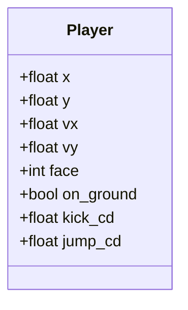
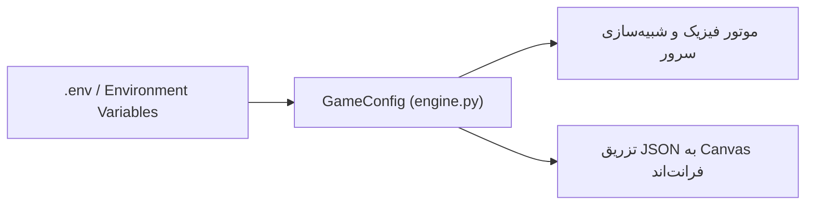

# موتور فیزیک و شبیه‌سازی (Game Physics Engine)

موتور بازی در فایل [`game/engine.py`](../game/engine.py) پیاده‌سازی شده است. این موتور یک سیستم شبیه‌سازی ۲ بعدی دقیق در سبک بازی‌های آرکید نوستالژیک **Head Ball** است.

---

## ۱. هندسه و مختصات زمین مسابقه

زمین مسابقه در یک دستگاه مختصات دو بعدی با مبدا در گوشه بالا-چپ تعریف شده است:

```text
(0,0) ------------------------------------------------ (1280, 0)
 |                                                         |
 |                                                         |
 | [دروازه آبی]                               [دروازه قرمز] |
 | (عمق: 105)                                  (عمق: 105)  |
 | (ارتفاع: 135)                              (ارتفاع: 135) |
 |                                                         |
(0, 610) ========= [سطح زمین بازی (Ground)] ============= (1280, 610)
(0, 720) ---------------------------------------------- (1280, 720)
```

| پارامتر | مقدار | توضیح |
| :--- | :--- | :--- |
| `width` | `1280 px` | عرض کل فضای بازی |
| `height` | `720 px` | ارتفاع کل صفحه بازی |
| `ground_y` | `610 px` | مختصات عمودی خط زمین بازی |
| `goal_depth` | `105 px` | عمق فرورفتگی هر دروازه |
| `goal_height` | `135 px` | ارتفاع دهانه تیر دروازه از سطح زمین |
| `ball_radius` | `22 px` | شعاع دایره توپ فوتبال |
| `player_width` | `58 px` | عرض مستطیل کلی هر بازیکن |
| `player_height` | `72 px` | ارتفاع کل هر بازیکن |

---

## ۲. مشخصات فیزیکی بازیکن (Player Physics)

مدل برخورد بازیکن ترکیبی از **یک دایره در بالا (سر بازیکن با شعاع ۲۷ پیکسل)** و **یک مستطیل در پایین (بدنه بازیکن)** است:



### ویژگی‌های حرکتی بازیکن:
- **سرعت حداکثر دویدن:** `385 px/s`
- **شتاب روی زمین:** `2800 px/s²` و شتاب ترمز: `3400 px/s²`
- **شتاب در هوا:** `1300 px/s²`
- **قدرت پرش:** `790 px/s` با گرانش بازیکن `2050 px/s²`
- **زمان بازیابی پرش (Jump Cooldown):** `0.38` ثانیه
- **محدوده مجاز حرکت:** بازیکنان فقط درون محوطه اصلی زمین مجاز به حرکت هستند و نمی‌توانند داخل تور دروازه بروند.

---

## ۳. مشخصات و رفتارهای توپ (Ball Physics)

- **گرانش توپ:** `1700 px/s²`
- **حداکثر سرعت مجاز توپ:** `1450 px/s`
- **ضریب بازگشت ارتجاعی (Bounce Restitution):**
  - برخورد با زمین: `0.58`
  - برخورد با دیوارهای عمودی: `0.84`
  - برخورد با سقف: `0.82`
  - برخورد با سر بازیکن: `0.78` (مناسب ضربه سر جهشی)
  - برخورد با بدنه بازیکن: `0.46`
  - برخورد با تیرک بالایی دروازه: `0.72`
- **اصطکاک لغزشی با زمین:** `0.980`

---

## ۴. مکانیک شوت‌ها و ضربات (Kick Mechanics)

بازیکن در صورتی که فاصله مرکزش با توپ کمتر از `126 px` باشد و `kick_cd <= 0` باشد، می‌تواند شوت بزند:

| نوع شوت | مولفه سرعت افقی | مولفه سرعت عمودی | Cooldown (ثانیه) | رفتار حرکتی |
| :--- | :--- | :--- | :--- | :--- |
| `KICK_LOW` | `+850 px/s` | `-170 px/s` | `0.40s` | شوت زمینی سریع و محکم به سمت دروازه حریف |
| `KICK_HIGH` | `+760 px/s` | `-620 px/s` | `0.46s` | شوت قوسی و هوایی (چیپ) برای عبور از بالای سر حریف |
| `KICK_CLEAR` | `+1000 px/s` | `-360 px/s` | `0.52s` | ضربه دفع اضطراری با قدرت بالا به دور از محوطه خودی |

> [!NOTE]
> سرعت بازیکن هنگام زدن شوت تا میزان `52%` به سرعت پرتاب توپ اضافه می‌شود؛ بنابراین شوت در حال دویدن شتاب بیشتری خواهد داشت.

---

## ۵. مکانیزم‌های ضد قفل‌شدگی و روان‌سازی (Anti-Stall & Anti-Lock)

برای جلوگیری از خسته‌کننده شدن مسابقات یا گیر کردن توپ در حالات خاص، سه سیستم هوشمند تعبیه شده است:

1. **برخورد همزمان دو بازیکن (Contested Kicks / Touches):**
   اگر هر دو بازیکن به صورت همزمان به توپ ضربه بزنند یا توپ بین دو بازیکن تحت فشار قرار گیرد، توپ به بالا پرتاب می‌شود (`Pop Up`) و هر دو بازیکن کمی به عقب پرتاب می‌شوند (`Recoil`).
2. **هد رو به جلو در سرعت بالا (Running Touch Lift):**
   اگر بازیکن با سرعت بالا به سمت توپ بدود و برخورد کند، توپ اندکی به بالا متمایل می‌شود تا به زیر پای بازیکن نچسبد و ضربات سر دیدنی خلق شود.
3. **ناظر ضد توقف مسابقه (Anti-Stall Watchdog):**
   اگر توپ برای بیش از `2.5 ثانیه` ساکن بماند (سرعت کمتر از `45 px/s` در نقاط دور از دسترس)، یک پرتاب آرام خودکار به سمت مرکز زمین انجام می‌شود. اگر پس از `5.0 ثانیه` همچنان بازی متوقف باشد، یک شروع مجدد (Kickoff) خودکار انجام می‌شود.

---

## ۶. تفکیک نرخ شبیه‌سازی و ضبط (Simulation vs Recording FPS)

- **نرخ محاسبات فیزیک (`physics_fps`):** `60 Hz` با ۲ ریزگام زمانی (`physics_substeps = 2`) که دقت برخوردها را تا معادل **۱۲۰ هرتز** بالا می‌برد و مانع از رد شدن توپ از موانع سریع (Tunneling Effect) می‌شود.
- **نرخ ذخیره فریم‌ها برای کلاینت (`record_fps`):** `20 Hz`. سرور تنها ۲۰ فریم در هر ثانیه به مرورگر می‌فرستد تا حجم داده‌های شبکه و ترافیک کاربر بسیار بهینه باقی بماند.

## ۷. پیکربندی داینامیک با متغیرهای محیطی (Dynamic Environment Configuration)

تمامی پارامترها و ابعاد فیزیکی بالا از طریق متغیرهای محیطی در زمان اجرای سرور قابل تنظیم هستند. در صورت عدم تعیین، مقادیر پیش‌فرض استاندارد اعمال می‌شوند:



| حوزه پارامترها | متغیرهای محیطی مرتبط | فایل راهنما |
| :--- | :--- | :--- |
| **زمین و دروازه‌ها** | `GAME_PLAYGROUND_WIDTH`, `GAME_PLAYGROUND_HEIGHT`, `GAME_GROUND_Y`, `GAME_GOAL_DEPTH`, `GAME_GOAL_HEIGHT` | [`.env.example`](../.env.example) |
| **توپ و الاستیسیته** | `GAME_BALL_RADIUS`, `GAME_GRAVITY`, `GAME_BALL_MAX_SPEED`, `GAME_FLOOR_BOUNCE`, `GAME_FLOOR_FRICTION`, `GAME_BALL_AIR_DRAG`, `GAME_BALL_IMPULSE_SCALE` | [`.env.example`](../.env.example) |
| **بازیکن و حرکت** | `GAME_PLAYER_WIDTH`, `GAME_PLAYER_HEIGHT`, `GAME_PLAYER_SPEED`, `GAME_PLAYER_JUMP_SPEED`, `GAME_PLAYER_GRAVITY`, `GAME_PLAYER_ACCELERATION` | [`.env.example`](../.env.example) |
| **شوت‌ها و نبردها** | `GAME_KICK_REACH`, `GAME_KICK_LOW_X/Y`, `GAME_KICK_HIGH_X/Y`, `GAME_KICK_CLEAR_X/Y`, `GAME_RUNNING_TOUCH_LIFT` | [`.env.example`](../.env.example) |
| **زمان‌بندی و دقت** | `GAME_MATCH_TIME`, `GAME_PHYSICS_FPS`, `GAME_RECORD_FPS`, `GAME_PHYSICS_SUBSTEPS` | [`.env.example`](../.env.example) |

---

## ناوبری مستندات

- ⬅️ **قبلی: [معماری سیستم و چرخه حیات (architecture.md)](./architecture.md)**
- 🏠 **[بازگشت به صفحه اصلی مستندات (README.md)](../README.md)**
- ➡️ **گام بعدی: [سیستم استراتژی و قوانین (strategy-system.md)](./strategy-system.md)**
